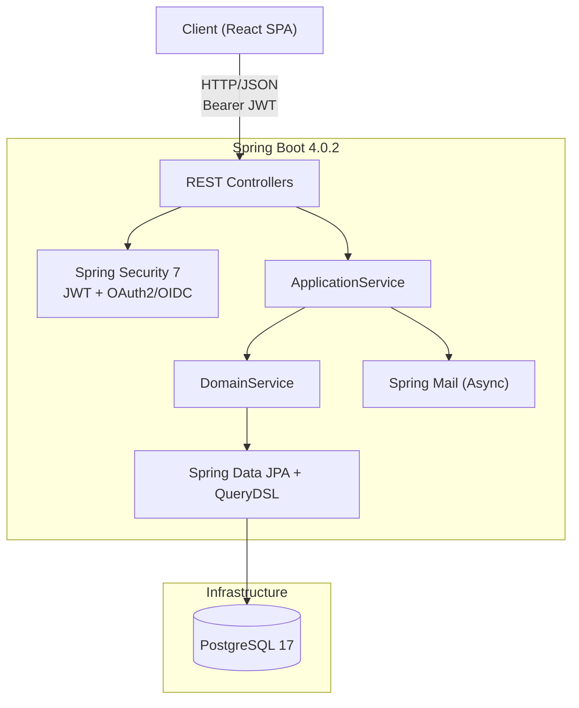

# JokaHobby


<Note: This is a cropped screenshot of a test demo to highlight the main dashboard area>

## Hobby Meetup Platform for Community Building

Connect people with shared interests by providing a platform to create, discover, and join hobby groups in their local area.

> **Migration Status**: SSR (Thymeleaf) to SPA (React) + REST API migration in progress. Thymeleaf is retained solely for email template rendering.

---

## Architecture



---

## Tech Stack

| Layer | Technology |
|-------|------------|
| **Backend** | Java 25, Spring Boot 4.0.2, Spring Framework 7.0 |
| **Security** | Spring Security 7, JWT (JJWT 0.12.6), OAuth2/OIDC (Google) |
| **Database** | PostgreSQL 17, Spring Data JPA, QueryDSL 5.1, Flyway |
| **Frontend** | React 19, TypeScript, Vite, TailwindCSS |
| **State Management** | Zustand, TanStack React Query |
| **Email** | Spring Mail (Gmail SMTP), Thymeleaf (email templates), Async via ThreadPoolTaskExecutor |
| **Testing** | JUnit 5, TestContainers, ArchUnit, WireMock, Vitest, Playwright |
| **Containerization** | Docker Compose (PostgreSQL 17) |

---

## Key Features

### User Management
- OAuth2/OIDC social login (Google) — no traditional signup/login
- JWT-based session (Access Token + Refresh Token with rotation)
- Configurable max sessions per account (default 5), with oldest session eviction
- Replay attack detection via token family tracking
- Profile customization (bio, image, location, nickname)
- Configurable email/web notification preferences
- Logout from single device or all devices

### Hobby Group System
- Create and manage hobby groups as a manager
- Member join/leave with count tracking
- Publishing workflow: Draft → Published → Closed
- Recruiting control with one-hour cooldown
- Tag and zone-based categorization
- Customizable banner image
- Soft delete for hobby removal

### Event & Enrollment
- FCFS (first-come-first-served) and Confirmative event types
- Enrollment with auto-accept (FCFS) or manager approval (Confirmative)
- Check-in / cancel check-in system for event attendance
- Enrollment accept/reject by managers
- Async notifications via Spring Events

### Discovery
- Published hobby listing with zone and sort filters
- Keyword-based hobby search with pagination

---

## Project Structure

```
jokahobby/
├── src/main/java/com/jokahobby/
│   ├── api/
│   │   ├── controller/v1/     # REST API controllers (versioned)
│   │   ├── dto/               # Request/Response DTOs (Java records)
│   │   │   ├── request/
│   │   │   │   └── validator/ # Custom Bean Validation constraints
│   │   │   └── response/
│   │   ├── exception/         # GlobalExceptionHandler
│   │   └── service/           # ApplicationService (orchestration layer)
│   ├── infra/
│   │   ├── config/            # AppConfig, AsyncConfig, SecurityConfig
│   │   ├── exception/         # ErrorCode enum, BusinessException
│   │   ├── mail/              # EmailService interface + implementations
│   │   ├── scheduler/         # RefreshToken cleanup scheduler
│   │   └── security/
│   │       ├── jwt/           # JwtProvider, JwtFilter, JwtProperties
│   │       └── oauth2/        # OAuth2/OIDC handlers and user services
│   └── modules/
│       ├── common/            # BaseEntity, SoftDeletableEntity
│       ├── account/           # Account, AccountService, RefreshTokenService
│       ├── hobby/             # Hobby CRUD, management, QueryDSL extension
│       ├── event/             # Event, Enrollment, Spring event listeners
│       ├── tag/               # Tag entity + service
│       ├── zone/              # Zone entity + service
│       └── notification/      # Notification entity + service
├── frontend/
│   └── src/
│       ├── api/               # Axios client + API service layer
│       ├── components/        # Reusable React components
│       ├── hooks/             # Custom React hooks
│       ├── pages/             # Route-mapped page components
│       ├── store/             # Zustand auth store
│       ├── types/             # TypeScript type definitions
│       └── utils/             # Validation schemas, formatters
├── docker-compose.yml
└── build.gradle.kts
```

## API Overview

### Authentication (OAuth2 flow)

| Method | Endpoint | Auth | Description |
|--------|----------|------|-------------|
| POST | `/api/v1/auth/refresh` | Cookie | Rotate refresh token, return new access token |
| POST | `/api/v1/auth/logout` | Cookie | Revoke current refresh token |
| POST | `/api/v1/auth/logout-all` | Bearer | Revoke all refresh tokens for the account |

> Login is handled via OAuth2 redirect (`/oauth2/authorization/google`), not a REST endpoint.

### Account

| Method | Endpoint | Auth | Description |
|--------|----------|------|-------------|
| GET | `/api/v1/accounts/{nickname}` | Public | View public profile |
| GET | `/api/v1/accounts/me` | Bearer | Get current account info |
| PUT | `/api/v1/accounts/me/profile` | Bearer | Update profile (bio, image, location) |
| PUT | `/api/v1/accounts/me/nickname` | Bearer | Update nickname |
| PUT | `/api/v1/accounts/me/notifications` | Bearer | Update notification preferences |
| GET | `/api/v1/accounts/me/tags` | Bearer | List interest tags |
| POST | `/api/v1/accounts/me/tags` | Bearer | Add interest tag |
| DELETE | `/api/v1/accounts/me/tags` | Bearer | Remove interest tag |
| GET | `/api/v1/accounts/me/zones` | Bearer | List preferred zones |
| POST | `/api/v1/accounts/me/zones` | Bearer | Add preferred zone |
| DELETE | `/api/v1/accounts/me/zones` | Bearer | Remove preferred zone |

### Hobby

| Method | Endpoint | Auth | Description |
|--------|----------|------|-------------|
| GET | `/api/v1/hobbies` | Public | List published hobbies (filter by zone/sort) |
| GET | `/api/v1/hobbies/search` | Public | Search hobbies by keyword |
| POST | `/api/v1/hobbies` | Bearer | Create new hobby |
| GET | `/api/v1/hobbies/{path}` | Public | Get hobby detail |
| DELETE | `/api/v1/hobbies/{path}` | Bearer | Delete hobby (manager) |
| GET | `/api/v1/hobbies/{path}/members` | Public | List hobby members |
| POST | `/api/v1/hobbies/{path}/members` | Bearer | Join hobby |
| DELETE | `/api/v1/hobbies/{path}/members` | Bearer | Leave hobby |

### Hobby Settings (Manager only)

| Method | Endpoint | Auth | Description |
|--------|----------|------|-------------|
| GET | `/api/v1/hobbies/{path}/settings` | Bearer | Get full settings |
| PUT | `/api/v1/hobbies/{path}/settings/description` | Bearer | Update description |
| PUT | `/api/v1/hobbies/{path}/settings/banner` | Bearer | Update banner image |
| POST | `/api/v1/hobbies/{path}/settings/banner/enable` | Bearer | Enable banner |
| POST | `/api/v1/hobbies/{path}/settings/banner/disable` | Bearer | Disable banner |
| GET | `/api/v1/hobbies/{path}/settings/tags` | Bearer | List hobby tags |
| POST | `/api/v1/hobbies/{path}/settings/tags` | Bearer | Add tag |
| DELETE | `/api/v1/hobbies/{path}/settings/tags` | Bearer | Remove tag |
| GET | `/api/v1/hobbies/{path}/settings/zones` | Bearer | List hobby zones |
| POST | `/api/v1/hobbies/{path}/settings/zones` | Bearer | Add zone |
| DELETE | `/api/v1/hobbies/{path}/settings/zones` | Bearer | Remove zone |
| POST | `/api/v1/hobbies/{path}/settings/publish` | Bearer | Publish hobby |
| POST | `/api/v1/hobbies/{path}/settings/close` | Bearer | Close hobby |
| POST | `/api/v1/hobbies/{path}/settings/recruit/start` | Bearer | Start recruiting |
| POST | `/api/v1/hobbies/{path}/settings/recruit/stop` | Bearer | Stop recruiting |
| PUT | `/api/v1/hobbies/{path}/settings/path` | Bearer | Update hobby path |
| PUT | `/api/v1/hobbies/{path}/settings/title` | Bearer | Update hobby title |

### Event & Enrollment

| Method | Endpoint | Auth | Description |
|--------|----------|------|-------------|
| POST | `/api/v1/hobbies/{path}/events` | Bearer | Create event |
| GET | `/api/v1/hobbies/{path}/events` | Public | List events |
| GET | `/api/v1/hobbies/{path}/events/{eventId}` | Public | Get event detail |
| PUT | `/api/v1/hobbies/{path}/events/{eventId}` | Bearer | Update event |
| DELETE | `/api/v1/hobbies/{path}/events/{eventId}` | Bearer | Delete event |
| POST | `/api/v1/hobbies/{path}/events/{eventId}/enrollments` | Bearer | Enroll in event |
| DELETE | `/api/v1/hobbies/{path}/events/{eventId}/enrollments` | Bearer | Cancel enrollment |
| PATCH | `/api/v1/hobbies/{path}/enrollments/{enrollmentId}/accept` | Bearer | Accept enrollment |
| PATCH | `/api/v1/hobbies/{path}/enrollments/{enrollmentId}/reject` | Bearer | Reject enrollment |
| PATCH | `/api/v1/hobbies/{path}/enrollments/{enrollmentId}/checkin` | Bearer | Check in attendee |
| PATCH | `/api/v1/hobbies/{path}/enrollments/{enrollmentId}/cancel-checkin` | Bearer | Cancel check-in |

### Notification

| Method | Endpoint | Auth | Description |
|--------|----------|------|-------------|
| GET | `/api/v1/notifications` | Bearer | List notifications (checked/unchecked) |
| GET | `/api/v1/notifications/unread-count` | Bearer | Get unread count |
| PATCH | `/api/v1/notifications/mark-as-read` | Bearer | Mark all as read |
| DELETE | `/api/v1/notifications` | Bearer | Delete read notifications |

---
