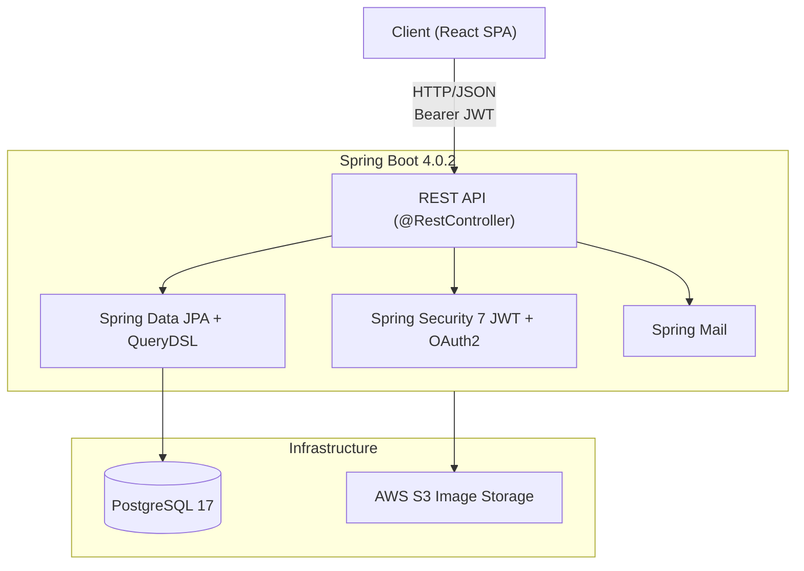

# JokaHobby

## Hobby Meetup Platform for Community Building

Connect people with shared interests by providing a platform to create, discover, and join hobby groups in their local area.

> **Migration Status**: SSR (Thymeleaf) to SPA (React) + REST API migration in progress. 

---

## Architecture



---

## Tech Stack

| Layer | Technology |
|-------|------------|
| **Backend** | Java 25, Spring Boot 4.0.2, Spring Framework 7.0 |
| **Security** | Spring Security 7.0.2, JWT (JJWT 0.12.6), OAuth2 (Google) |
| **Database** | PostgreSQL 17, Spring Data JPA, QueryDSL 5.1, Flyway |
| **Frontend** | React 19, TypeScript, Vite, TailwindCSS |
| **State Management** | Zustand, TanStack React Query |
| **Cloud** | AWS EC2, RDS, S3, Route 53 |
| **Email** | Spring Mail (Gmail SMTP) |
| **Testing** | JUnit 5, TestContainers, ArchUnit, Vitest, Playwright |
| **Containerization** | Docker Compose |

---

## Key Features

### User Management
- JWT-based authentication (Access Token + Refresh Token with rotation)
- OAuth2 social login (Google)
- Profile customization (bio, image, location)
- Configurable email/web notification preferences
- Multi-device support (up to 5 concurrent sessions)

### Hobby Group System
- Create and manage hobby groups as a manager
- Member join/leave with count tracking
- Publishing workflow: Draft -> Published -> Closed
- Recruiting control with time-limited status
- Tag and zone-based categorization

### Event & Enrollment
- FCFS (first-come-first-served) and Confirmative event types
- Enrollment with auto-accept (FCFS) or manager approval (Confirmative)
- Check-in system for event attendance
- Async notifications via Spring Events

### Discovery
- Keyword-based hobby search with pagination
- Personalized recommendations based on interest tags

---

## Project Structure

```
jokahobby/
├── src/main/java/com/jokahobby/
│   ├── api/
│   │   ├── controller/        # REST API controllers
│   │   ├── dto/               # Request/Response DTOs (Java records)
│   │   │   ├── request/
│   │   │   └── response/
│   │   └── exception/         # Global exception handler
│   ├── infra/
│   │   ├── config/            # App, Security, CORS configs
│   │   ├── exception/         # ErrorCode enum, business exceptions
│   │   ├── mail/              # Email services
│   │   ├── scheduler/         # Token cleanup scheduler
│   │   └── security/
│   │       ├── jwt/           # JwtProvider, JwtFilter, JwtProperties
│   │       └── oauth2/        # OAuth2 handlers, CustomOAuth2UserService
│   └── modules/
│       ├── account/           # Account entity, AuthService, RefreshToken
│       ├── hobby/             # Hobby CRUD & management
│       ├── event/             # Event & enrollment
│       ├── tag/               # Tag management
│       ├── zone/              # Location management
│       └── notification/      # Notification system
├── frontend/
│   └── src/
│       ├── api/               # Axios client + API service layer
│       ├── components/        # Reusable React components
│       ├── hooks/             # Custom React hooks
│       ├── pages/             # Route-mapped page components
│       ├── store/             # Zustand auth store
│       ├── types/             # TypeScript type definitions
│       └── utils/             # Validation schemas, formatters
├── docker-compose.yml
├── build.gradle.kts
└── .env.example
```


## API Overview

| Method | Endpoint | Description |
|--------|----------|-------------|
| POST | `/api/v1/auth/signup` | Register new account |
| POST | `/api/v1/auth/login` | Login (returns JWT) |
| POST | `/api/v1/auth/refresh` | Refresh access token (cookie) |
| POST | `/api/v1/auth/logout` | Revoke refresh token |
| GET | `/api/v1/accounts/{nickname}` | Public profile |
| GET | `/api/v1/hobbies/search` | Search hobbies |
| POST | `/api/v1/hobbies` | Create hobby |
| POST | `/api/v1/hobbies/{path}/events` | Create event |

---
