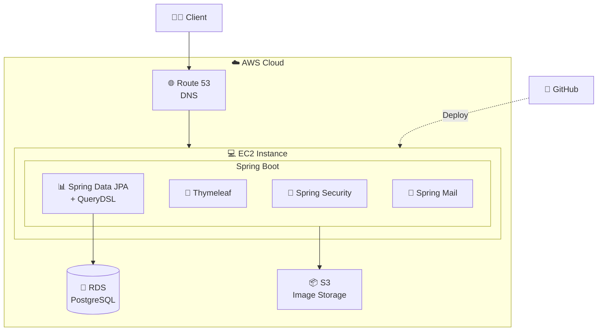

# JokaHobby
## Hobby Meetup Platform for Community Building

### Overview
Connect people with shared interests by providing a platform to create, discover, and join hobby groups in their local area.

---

## Architecture



### Tech Stack
| Layer | Technology |
|-------|------------|
| **Backend** | Java 25, Spring Boot 4.0.2 |
| **Security** | Spring Security 6 |
| **Database** | PostgreSQL, JPA, QueryDSL |
| **Template** | Thymeleaf |
| **Cloud** | AWS EC2, RDS, S3, Route 53 |
| **Email** | Spring Mail |
| **Testing** | JUnit 5, TestContainers, ArchUnit |

---

## Key Features

### 1. User Management
- **Email Verification**: Secure registration with email token validation
- **Profile Customization**: Bio, profile image, occupation, location
- **Notification Preferences**: Configurable email/web notifications

### 2. Hobby Group System
- **Create & Manage**: Users can create hobby groups as managers
- **Member Management**: Join/leave groups, member count tracking
- **Publishing Workflow**: Draft → Published → Closed lifecycle
- **Recruiting Control**: Time-limited recruiting status updates

### 3. Event & Enrollment
- **Event Creation**: Schedule meetups within hobby groups
- **Enrollment System**: Apply to join events
- **Async Notifications**: Event-driven enrollment updates

### 4. Discovery System
- **Tag-Based Search**: Find hobbies by interest tags
- **Location Filtering**: Zone-based geographic search

---

## Project Structure
```
src/main/java/com/jokahobby/
├── infra/
│   ├── config/          # App, Security, Web, Async configs
│   └── mail/            # Email services
└── modules/
    ├── account/         # User authentication & settings
    ├── hobby/           # Hobby CRUD & management
    ├── event/           # Event & enrollment
    ├── tag/             # Tag management
    ├── zone/            # Location management
    ├── notification/    # Notification system
    └── main/            # Main controller
```

---

## Getting Started

### Prerequisites
- Java 25
- PostgreSQL
- Node.js 20.x

### Build & Run
```bash
# Full build (includes frontend)
./gradlew build

# Run application
./gradlew bootRun
```

### Testing
```bash
./gradlew test
```


